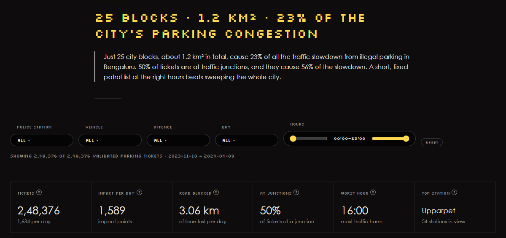
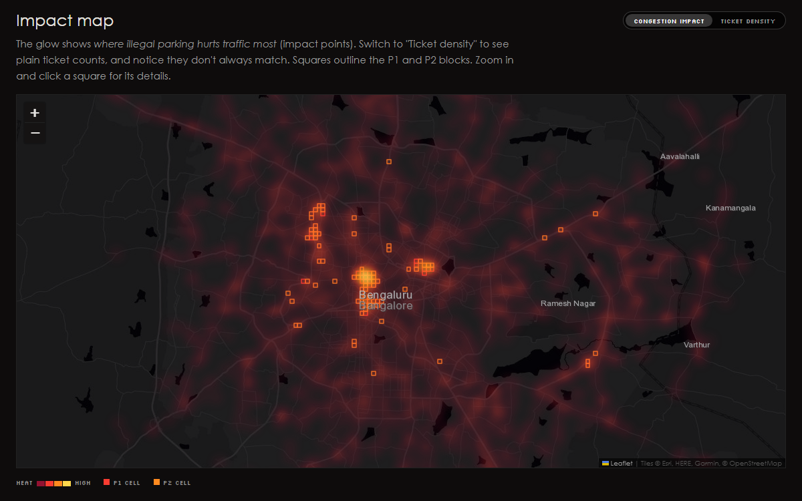
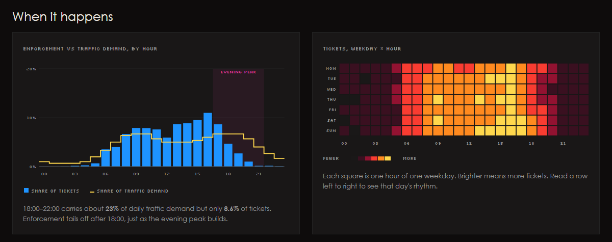
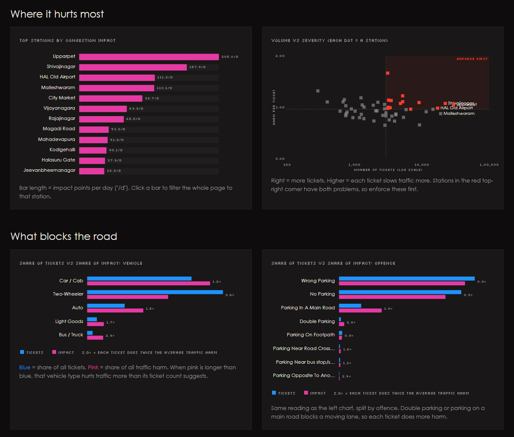
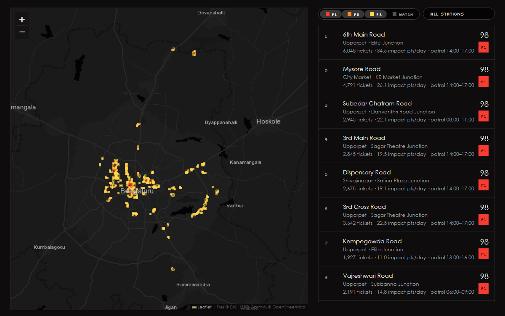
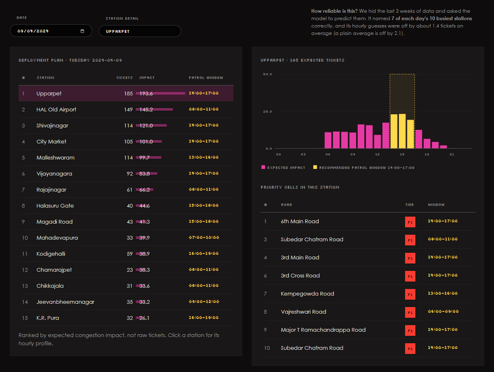
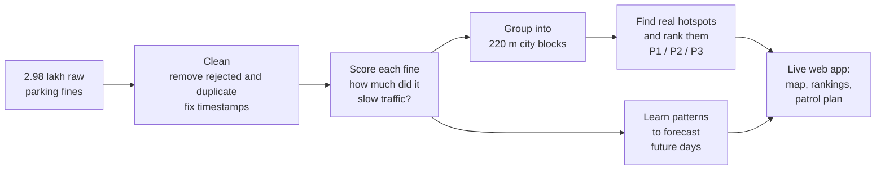

# ParkIntel: Parking Congestion Intelligence for Bengaluru

**Flipkart GRiDLOCK 2.0 · Problem Statement 1: Poor Visibility on Parking-Induced Congestion**

> Illegal parking doesn't just break a rule, it takes away road space and slows everyone down.
> ParkIntel shows traffic police **where** illegal parking hurts traffic most, **how much**, and **when** to send patrols.

### 🔗 Live demo: **https://karthikeya70.github.io/Gridlock-2.0/**
*No install needed. It runs in your browser and works on phones too.*



---

## The problem in one minute

Bengaluru Traffic Police issue lakhs of parking fines (called **e-challans**). But today:

- Enforcement is **reactive**: officers patrol and react to what they see.
- There is **no map** showing which illegal parking actually causes traffic jams.
- It is **hard to decide where to send officers first**.

Counting fines alone is misleading. A scooter parked on a quiet lane at 3 AM and a bus double-parked at a busy junction at 6 PM each count as "1 fine", but only one of them causes a traffic jam.

**The question we answer:**
*Can we find illegal-parking hotspots, measure how much they slow traffic, and tell police exactly where and when to act?*

---

## What ParkIntel does

The app has four pages:

| Page | What it answers | For whom |
|---|---|---|
| **Overview** | Where and when does illegal parking hurt traffic? What kinds of vehicles and offences cause the most harm? | Anyone |
| **Hotspots** | Which exact city blocks should police patrol first, and at what time? | Traffic police planners |
| **Forecast** | For a chosen date, which areas will be worst and when? | Patrol supervisors |
| **Method** | How is everything calculated? What do the terms mean? | Judges, reviewers, curious readers |

### 1. The impact map: *where* it hurts
The glow shows where illegal parking slows traffic most. You can switch between **traffic impact** and plain **ticket counts** and see that they don't always match. That gap is the whole point of the project.



### 2. *When* it happens
Left: when police issue tickets (blue bars) vs when roads are busiest (yellow line). Enforcement fades after 6 PM, just as the evening rush builds.
Right: every square is one hour of one weekday. Brighter means more tickets.



### 3. *Who* and *what* blocks the road
Which police station areas suffer most, and which vehicles and offences do more damage than their ticket count suggests. For example, one bus does far more harm than one scooter.



### 4. A ranked patrol list
The city is cut into ~220 m squares (about one city block). Each gets a **priority score (0–100)** and a tier:
**P1** = top 25 blocks (patrol daily), **P2** = next 75, **P3** = other proven hotspots. Each block also gets a **patrol window**: the 3 hours when it hurts traffic most.



### 5. A patrol plan for any date
Pick a date and get a ranked list of stations with the best time to patrol each one, based on a forecast learned from past patterns.



---

## Key findings

| Finding | Number |
|---|---|
| Fines analysed (after removing rejected and duplicate ones) | **2,48,376** (from 2,98,450) |
| Traffic slowdown caused by just the **top 25 blocks** (≈1.2 km²) | **23%** of the city total |
| Tickets at traffic junctions, and their share of the slowdown | **50%** of tickets → **56%** of slowdown |
| Evening rush (6–10 PM): share of traffic vs share of tickets | **~23%** of traffic, only **8.6%** of tickets |
| Worst areas | Majestic / Gandhinagar (Upparpet), KR Market, Shivajinagar |
| Forecast accuracy: busiest stations correctly predicted | **7 out of 10** each day |

**In short:** police can fix almost a quarter of parking-related congestion by focusing on 25 blocks at the right hours, instead of sweeping the whole city.

---

## How it works (plain English)



**Step 1: Clean the data.** 50,074 fines were marked *rejected* or *duplicate* by validators, so they aren't real violations and are removed. The timestamps were also shifted by mistake in the original export. We found this because human validators appeared to work at 3–6 AM, and we corrected it (details on the Method page).

**Step 2: Score how much each fine slowed traffic.** Each fine gets **impact points**:

```
impact = vehicle size × how much lane it blocks × junction bonus × how busy the road is at that hour
```

| Factor | Example values | Why |
|---|---|---|
| Vehicle size (PCU, Indian Roads Congress IRC:106) | scooter 0.5 · car 1 · auto 1.2 · bus/truck 2.2 | Bigger vehicles take more road |
| Lane blocked | kerb 1 · main road 2 · near a crossing 2 · double parking 3 | Some offences block a moving lane |
| Junction bonus | 1.5 at a named traffic junction | Junctions are where traffic already queues |
| Road busyness | rush hour 1.0 · 3 AM 0.1 | A blocked lane matters most when roads are full |

**1 impact point = one car parked at the kerb during rush hour.**

**Step 3: Find the hotspots.** The city is divided into ~220 m squares. A standard statistical test (**Getis-Ord Gi\***) checks whether a block *and its neighbours* are unusually bad, so we don't chase one-off spikes. Blocks are then ranked on traffic harm, how many days it happens, junction share and hotspot strength.

**Step 4: Forecast.** A machine-learning model (gradient boosting) learns each station's weekly and hourly pattern and predicts tickets and traffic harm for any date. It was tested honestly on 3 weeks of data it never saw.

---

## Words you'll see

| Term | Meaning |
|---|---|
| **E-challan / ticket** | A digital parking fine with location, time, vehicle and offence |
| **Impact point** | Our unit of traffic harm (1 = a car at the kerb in rush hour) |
| **PCU** | Passenger Car Unit: road space a vehicle takes compared to a car |
| **Block / cell** | A ~220 m × 220 m square of the city |
| **P1 / P2 / P3** | Priority tiers for patrolling |
| **Patrol window** | The 3-hour slot when a block hurts traffic most |
| **Gi\* (hotspot test)** | Checks whether a cluster is real or just random noise |
| **MAE** | Average prediction error (lower is better) |
| **Data leakage** | When a model accidentally sees test answers during training. We fixed this in the original model |

The app's **Method** page has a full glossary, and every number on the dashboard has a **?** you can hover for an explanation.

---

## Run it yourself

The easiest way is the **[live demo](https://karthikeya70.github.io/Gridlock-2.0/)**.

To run it on your own computer, you only need Python (for its built-in mini web server). No packages to install:

```bash
git clone https://github.com/Karthikeya70/Gridlock-2.0.git
cd Gridlock-2.0
python -m http.server 8000 --directory web
```

Then open **http://localhost:8000** in your browser.

> **"Port already in use" error?** Another program is using port 8000. Use `8001` instead and open http://localhost:8001.
>
> **Why not just double-click `index.html`?** Browsers block pages opened from disk from loading their data files, so it needs a tiny local server like the one above.

### Rebuilding the data from scratch (optional)
The raw dataset (`PS1_Dataset.csv`, 105 MB) is **not in this repo** because GitHub doesn't allow files over 100 MB. If you have it from the GRiDLOCK 2.0 problem page:

1. Put `PS1_Dataset.csv` in the project folder.
2. Run `pip install -r requirements.txt`, then `python pipeline.py` (takes about 30 seconds). This rebuilds everything in `web/data/`.
3. Start the local server as above.

### How the live site is published
Every push to `main` automatically republishes the site through GitHub Pages (see `.github/workflows/pages.yml`). The whole app is static: all filtering and forecasting happens in the browser, so there's no server to pay for or keep running.

---

## Project structure

```
Gridlock-2.0/
├── pipeline.py        # Data cleaning, impact scoring, hotspot ranking, forecast model → writes web/data/
├── web/               # The whole app. This folder is what gets published online
│   ├── index.html     # Page layout and text
│   ├── styles.css     # Look and feel (inspired by arcprize.org)
│   ├── app.js         # Map, charts, filters, forecast plan (all computed in the browser)
│   └── data/          # Pre-computed results (so the app runs without the raw dataset)
│       ├── records.bin      # 2.5 lakh cleaned fines, packed into 2.3 MB
│       ├── hotspots.json    # Ranked city blocks
│       ├── forecast.json    # Forecast per station × weekday × hour
│       └── meta.json        # Summary numbers, model accuracy, settings
├── .github/workflows/ # Auto-publishes web/ to GitHub Pages
├── docs/              # Screenshots used in this README
├── main.ipynb         # Early exploration notebook (first draft, superseded by pipeline.py)
└── requirements.txt
```

---

## How we checked the results against real life

| Check | Result |
|---|---|
| Do junction locations in the data match the real ones? | ✅ KR Market, Safina Plaza, Sagar Theatre, Windsor Circle and Minsk Square are all within ~100 m of their real positions |
| Do police-station areas land in the right part of the city? | ✅ Whitefield in the east, Electronic City in the south, Yelahanka in the north, and so on |
| Are the top hotspots known trouble spots? | ✅ Majestic/Gandhinagar, KR Market and Shivajinagar are Bengaluru's best-known central congestion areas |
| Are the timestamps realistic? | ⚠️ No. As exported, validators appeared to work at 3–6 AM. After correcting the shift, 64% of validation happens 10 AM–6 PM and tickets follow a normal 6 AM–8 PM enforcement day |

## Limitations (being honest)

- **Impact is estimated, not measured.** The dataset has no traffic-speed data, so impact is calculated from vehicle size, lane blocked, junction and time. With live speed data (e.g. Google, TomTom or BTP sensors), the weights could be calibrated.
- **Tickets show when police enforced, not every moment a car was parked illegally.** Late evenings are under-counted because patrols thin out after 6 PM.
- **The timestamp correction is inferred** from validator work hours. It should be confirmed with the data owner.
- **The forecast is best at ranking** (which stations will be busiest), not at exact hourly counts. Hourly ticket data is noisy because it depends on when patrols go out.

## What could come next

1. Live ticket feed instead of a CSV file
2. Real traffic-speed data to measure (not estimate) the impact
3. A mobile view for officers with their shift's patrol route
4. A feedback loop: after enforcement, check whether traffic on that road actually improved

---

**Tech:** Python · pandas · scikit-learn (data and models) · Leaflet (maps) · plain JavaScript and SVG (charts) · GitHub Pages (hosting)

Built for **Flipkart GRiDLOCK 2.0**.
